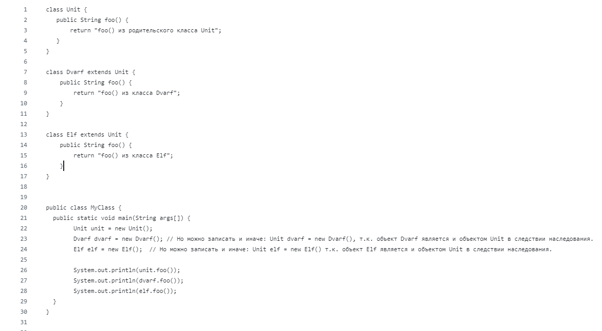
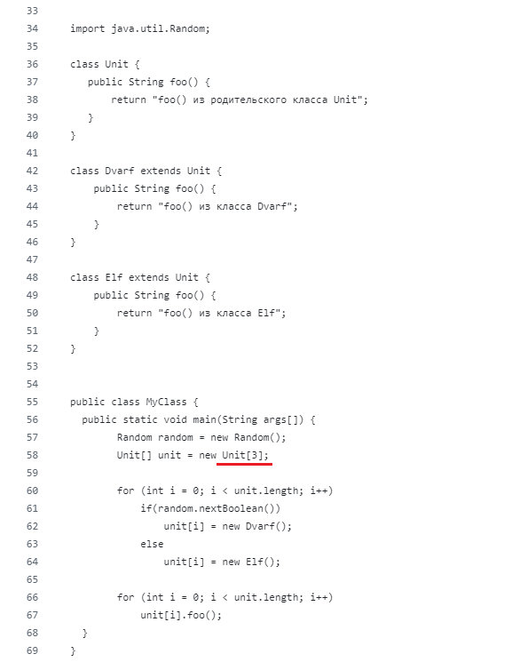
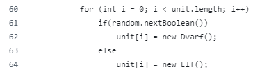

# Рефлексия:
***

### 4.1.
### Видимо я неправильно понял задание. Создал класс, объект которого состоит из трёх объектов других классов:
~~~
class Unit {
    private View view;
    private Item item;
    private Characteristics characteristics;
}    
~~~

~~~
public class MyClass {
    public static void main(String args[]) {
        
        View view = new View ("Tranduil", 200, 2);
        Item item = new Item ("Лук");
        Characteristics character = new Characteristics (40, 10, 5, 8, 30);
        Unit unit = new Unit(view, item, character);
        
        System.out.println(unit.printState());
    }
}
~~~

### Не реализовал методы, чтобы показать взаимодействие между объектами класса. Создал простой метод для наглядности композиции:
~~~
public String printState() {
    return "Имя юнита " + view.getName() +  ", а количество здоровья у него равно " + characteristics.getHealth() + " единицам";
}
~~~
***

### 4.2.
### Решение аналогично ответу к заданию, но для увеличения наглядности упростил код и избавился от переменных которые не использовал в задании.

### Допущена ошибка, вместо 500 указал 3. Использовал данное число при работе с визуализатором:

### При создании массива из 500 объектов использовал метод, который возвращает случайное значение типа boolean.
