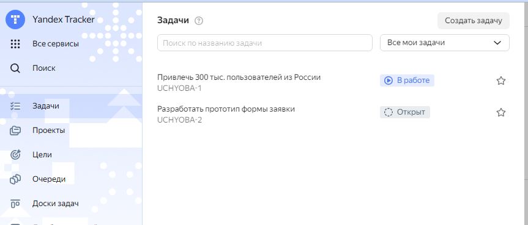
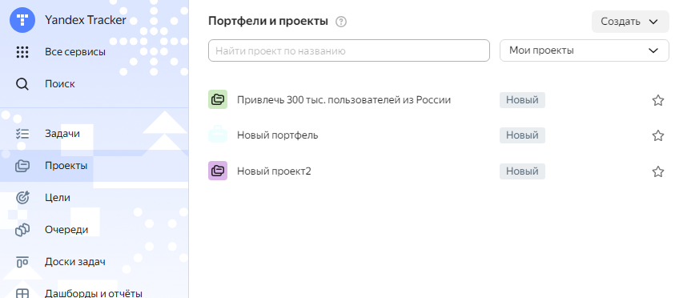
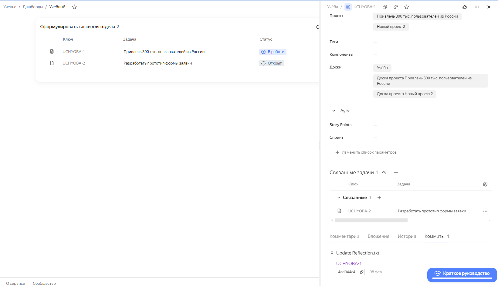
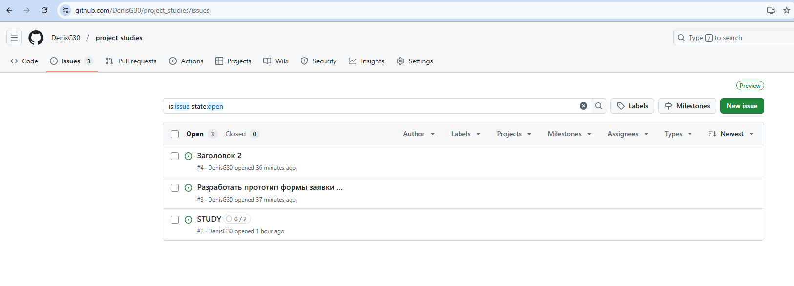
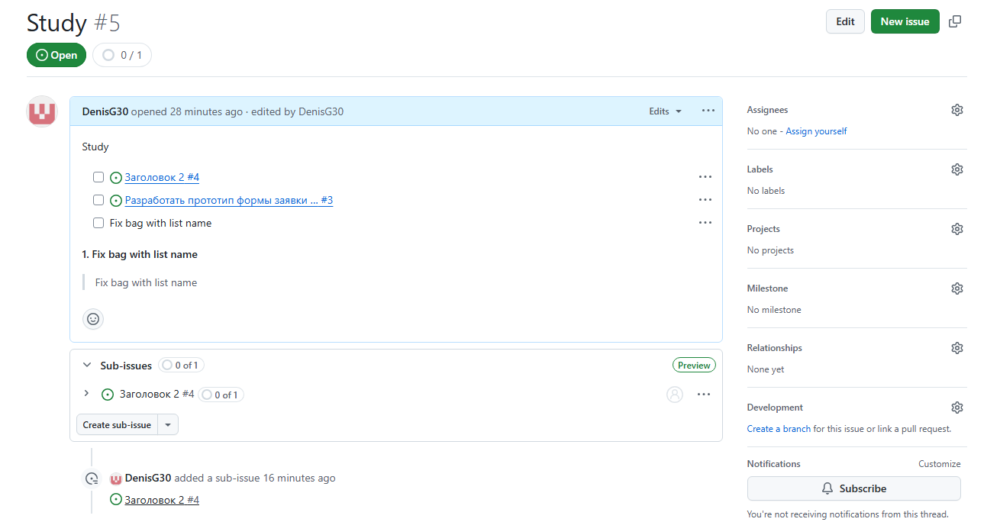

# 1. Яндекс трекер

### <u>Плюсы:</u>
### – Удобный интуитивно понтяный веб-интерфейс десктоп версии.
### – Лёгкий и широкий доступ к любому разделу из другого. 
> (Возможность связывать задачи с проектами, портфелями при создании или редактировании задачи, проекта и т.д.)
### – Объемная документация
### – Отсутсвие языкового барьера
### – Возможность добавлять коммиты с других источников
### – Широкий выбор инструементов, аккуратный дизайн, позволяющих в несколько кликов понять что к чему.

> ### Неудобство для меня, которое я заметил в начале, для добавления проекта в портфель или задачи в проект необходимо указывать часть наименования, например, первые буквы.
>
> ### Я не обладаю информацией, какое количество задач обычно используют организации, на предполагаю, что выпадающий список удобен, когда задач на пару десятков. Если же задач сотни, данная реализация удобнее.

***
# 2. GitHub Issues
### <u>Плюсы:</u>
### – Возможность создания подпроблемы в каждой проблеме. Аналогично добавлению задачи в проект Яндекс Трекер. 
### – Удобное использование меток для каждой проблемы.

> ### Несмотря на небольшой набор возможностей (должно быть проще, наличие языкового барьера и слабого интерфейса (на мой взгляд), делают данный инструмент уступающим в удобстве тому же яндексу.
>
> ### Пробовал найти за что-то можно ухватится, чтобы хоть как-то оправдать данный инструмент, но не нашёл. Возможно в силу отсутсвия у меня опыта работы или взаимодействия в данной сфере.

***
# 3. Redmine

> ### Возможно в силу своей неопытности, данный инструмент показался максимально неудобным. Как я понял задачи являются общедоступными, приложение необходимо устанавливать на своей машине.
> 
> ### Стоит отменить с положительной стороны наличие простого дизайна без лишних визуальных элементов и наличие документации с переводом на русский язык, что препятствует возникновению языкового барьера.

***
# Вывод:

> ### Итоговый вывод для себя я делаю следующий. Удобным инструментом с большим количеством возможностей является Яндекс трекер. На нём я бы остановил свой выбор.
>
> ### Но в его отсутсвии и GitHub Issue было бы достаточно.

***