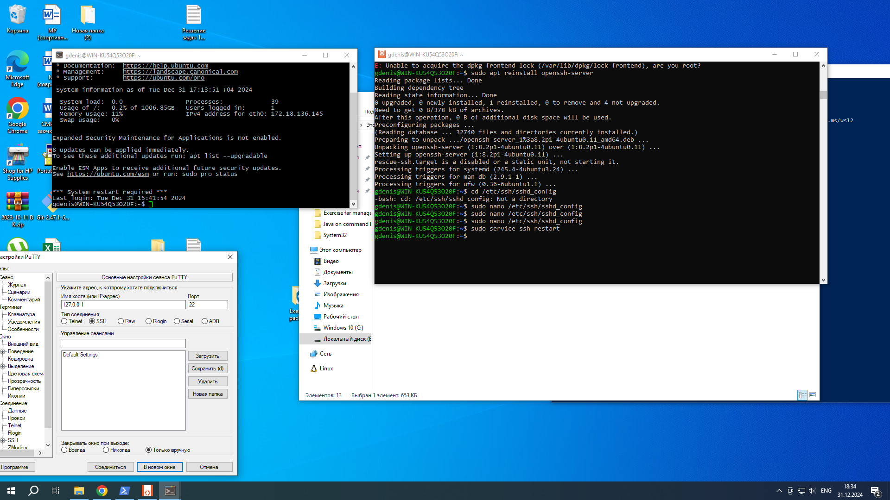

# Report of Ubuntu"
---
* Установил Ubuntu и wsl для Windows
* Разобрался с работой терминала.
* Добавил Midnight Commander 
* Создал ssh соединение для PuTTY
* Прошел 4 из 19 уроков курса hexlet
---
    Буду и дальше разбираться с Linux и Ubuntu параллельно обучению!
